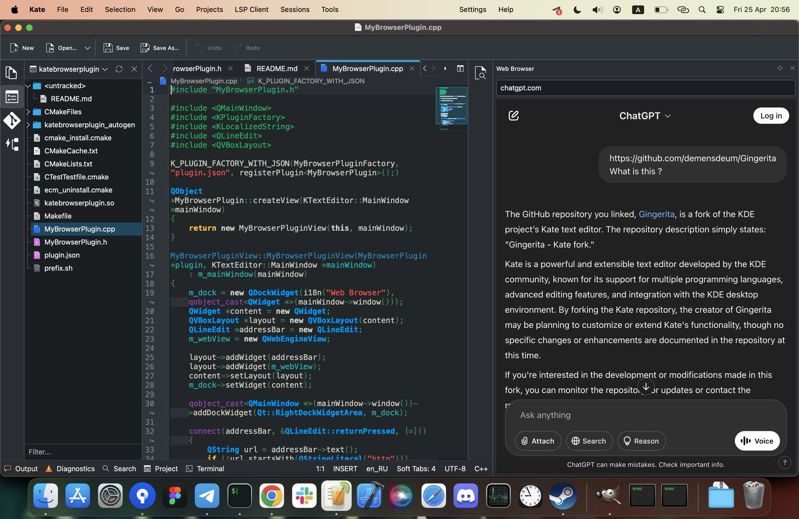

Gingerita is [Kate](https://github.com/KDE/kate) fork

New features:

* Kate Web Browser plugin: https://github.com/demensdeum/kate-browser-plugin
* Kate Image Preview plugin: https://github.com/demensdeum/kate-image-preview-plugin
* Rename directories ability for Project-Plugin

Build for MacOS:

* Install CraftRoot into ~/CraftRoot
* checkout Gingerita repo
* source ~/CraftRoot/craft/craft.env
* cmake .
* make
* open bin/kate.app
